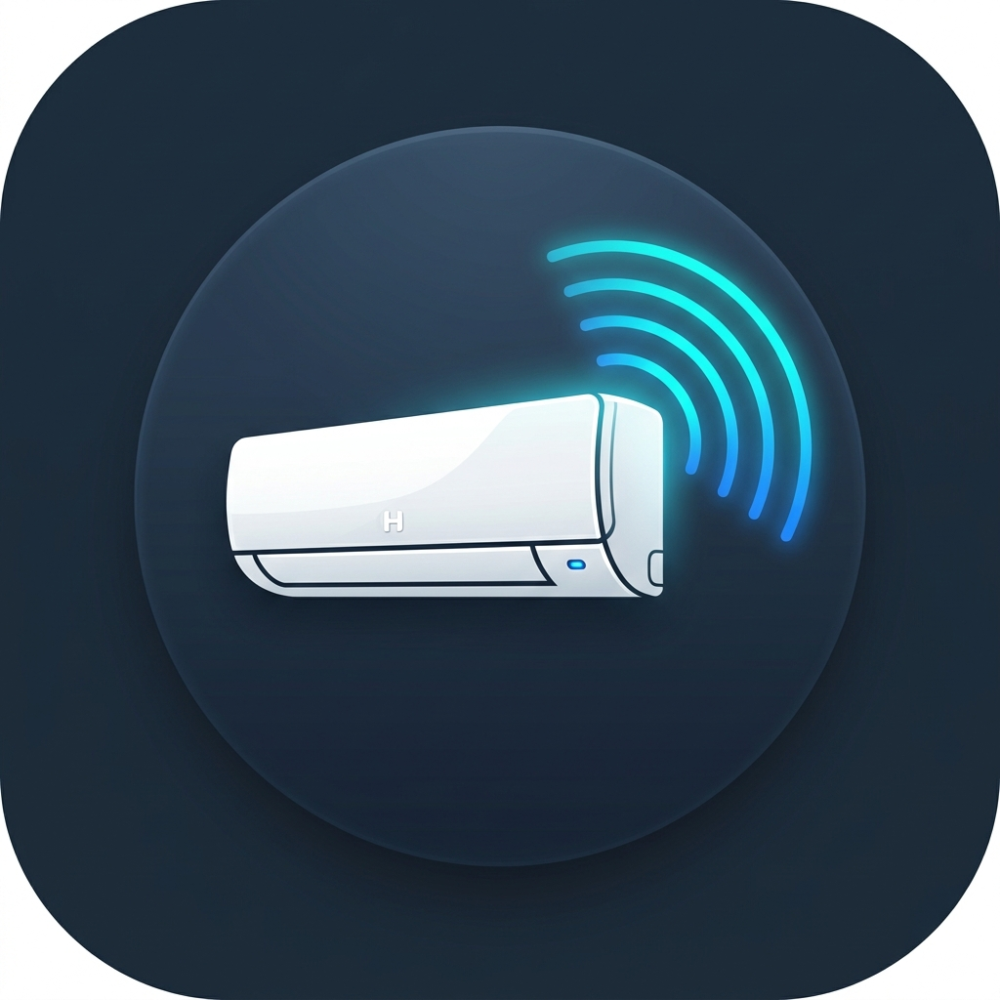

# Hitachi Infrared Remote Integration for Home Assistant

<p align="center">
  
</p>


[](https://github.com/hacs/default)
[](https://github.com/petercpg/hitachi_infrared/releases)
[](LICENSE)

A Home Assistant custom component that provides comprehensive climate control for **Hitachi Air Conditioners** via IR remote controls (Broadlink, Xiaomi MiIO / Pronto, ESPHome, or native HA Infrared transmitters).

Powered by the [`infrared-protocols`](https://github.com/petercpg/infrared-protocols) python library (forked from Home Assistant's official [`home-assistant/infrared-protocols`](https://github.com/home-assistant/infrared-protocols)), this integration generates full 344-bit protocol payloads dynamically without needing bloated static code tables.


---

## ✨ Features

- 🌡️ **Full Climate Control**: Supports Cooling, Heating, Dehumidification (Dry), Fan Only, and Auto modes.
- 🌀 **Multi-Stage Fan & Swing**: Full 5-stage fan speeds (Auto, High, Medium, Low, Silent) and vertical / 6-stage horizontal swing control.
- 📡 **Universal Emitter Compatibility**: Supports native HA `infrared` transmitters, Broadlink Base64 (`b64:`), Pronto Hex, and Raw Microsecond timings (ESPHome/GPIO).
- 🌡️💧 **External Sensor Binding**: Bind external temperature and humidity sensor entities for real-time room ambient tracking.
- 🔄 **State Restoration**: Persists HVAC mode, target temperature, fan speed, and swing settings across Home Assistant restarts.
- 🛠️ **Custom Services**: Entity services for Display Toggle, PM2.5 LCD Toggle, On/Off Timers, Mold Prevention (機體防霉), and Clean Cycle (凍結洗淨).
- ⚙️ **Live Options Flow**: Re-configure all settings (emitter, encoding, sensors, cool-only, entity name) anytime from the UI without restarting HA.
- 🔔 **Debug Toast Notifications**: Live UI toast popups showing full payload parameters when DEBUG logging is active.
- 🌐 **Multi-Language Support**: Fully localized in English (`en`) and Traditional Chinese (`zh-Hant`).

---

## 🗺️ Compatibility Matrix

This integration uses a modular protocol engine designed to support various Hitachi IR remotes and emitters.

| Category | Verified & Supported |
| :--- | :--- |
| **Protocol** | `ac344` (344-bit / 43 Bytes) |
| **IR Emitters** | Native HA `infrared`, Broadlink (RM4/RM Pro), Xiaomi MiIO IR |
| **Device Types** | Air Conditioners (`climate`) |

> ⚠️ **Disclaimer & Community Contributions**
>
> This integration is primarily developed and verified on **Hitachi split-type (HV)AC units using the `ac344` protocol**.
>
> While the codebase is designed to support other Hitachi protocols, devices, and IR emitters, **the maintainer does not own every hardware combination to verify compatibility**.
> - **Tested successfully on your model?** Please open a [GitHub Issue or Discussion](https://github.com/petercpg/hitachi_infrared/issues) to let us know so we can update the tested device matrix!


---

## 📦 Installation

### Option 1: Via HACS (Recommended)

1. Ensure [HACS](https://hacs.xyz/) is installed in your Home Assistant.
2. Open HACS ➔ **Integrations**.
3. Click the three dots in the top right corner ➔ **Custom repositories**.
4. Add Repository URL: `https://github.com/petercpg/hitachi_infrared`, Category: **Integration**.
5. Search for **Hitachi Infrared Remote Integration** and click **Download**.
6. Restart Home Assistant.

### Option 2: Manual Installation

1. Download the latest release source code.
2. Copy the `custom_components/hitachi_infrared` directory to your Home Assistant's `config/custom_components/` directory.
3. Restart Home Assistant.

---

## ⚙️ Configuration

### Method 1: UI Configuration (Config Flow & Options Flow)

1. In Home Assistant, go to **Settings ➔ Devices & Services**.
2. Click **Add Integration** and search for **Hitachi Infrared Remote**.
3. Fill in the setup form:
   - **Name (Optional)**: e.g., `Living Room AC`.
   - **Infrared / Remote Entity**: Select your transmitter (e.g., `remote.broadlink_rm4_mini` or `remote.xiaomi_ir_remote`).
   - **IR Signal Encoding**: Choose `Broadlink Base64`, `Pronto Hex (Xiaomi / MiIO)`, or `Raw Microseconds (ESPHome)`.
   - **Temperature / Humidity Sensors (Optional)**: Select ambient sensors for room tracking.
   - **Cool Only**: Check if your AC is a cooling-only unit (hides HEAT mode).

> 💡 **Re-configuring Options**:
> Click **Configure** on the integration card anytime to change emitters, encoding, or sensors. All updates take effect **instantly** without restarting Home Assistant.

### Method 2: YAML Configuration

Add the following to your `configuration.yaml`:

```yaml
climate:
  - platform: hitachi_infrared
    name: "Living Room AC"
    remote_entity: "remote.broadlink_rm4_mini"
    encoding: "broadlink" # broadlink, pronto, or raw
    temperature_sensor: "sensor.living_room_temperature"
    humidity_sensor: "sensor.living_room_humidity"
    cool_only: false
```

---

## 🛠️ Custom Entity Services

This integration registers custom Home Assistant services for advanced Hitachi AC features:

| Service | Action Description | Parameters |
| :--- | :--- | :--- |
| `hitachi_infrared.set_display` | Toggle indoor unit LCD display | `active` (boolean) |
| `hitachi_infrared.set_pm25` | Toggle indoor PM2.5 concentration reading | `active` (boolean) |
| `hitachi_infrared.set_timer` | Set On/Off timer reservation | `timer_type` (`off_timer`/`on_timer`), `duration` (hours) |
| `hitachi_infrared.cancel_timer` | Cancel active timer | None |
| `hitachi_infrared.run_clean` | Trigger Frost Wash / Clean Cycle (凍結洗淨) | None |
| `hitachi_infrared.set_mold_prevention` | Set Mold Prevention (機體防霉) | `active` (boolean), `duration` (minutes) |

---

## 🔍 Debugging & Live Toast Notifications

To enable verbose debug logging for this integration, add the following to your `configuration.yaml` or use **Enable Debug Logging** on the integration page:

```yaml
logger:
  default: info
  logs:
    custom_components.hitachi_infrared: debug
```

When DEBUG mode is enabled:
1. Integration startup prints full `infrared-protocols` version and Git commit hashes to the logs.
2. Every transmitted IR action triggers a **Live Toast Notification** popup in the Home Assistant UI detailing the exact parameters sent!

---

## 🙏 Credits & Acknowledgments

- Special thanks to the **[Home Assistant](https://github.com/home-assistant)** team and contributors.
- The [`petercpg/infrared-protocols`](https://github.com/petercpg/infrared-protocols) python library used by this integration is forked from Home Assistant's official [`home-assistant/infrared-protocols`](https://github.com/home-assistant/infrared-protocols) project, extended with Hitachi `ac344` 344-bit protocol support.

---

## 📄 License

This project is licensed under the **MIT License** - see the [LICENSE](LICENSE) file for details.

